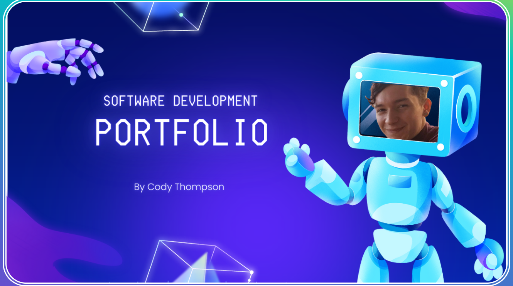

### Languages:

### Technologies and dependencies:

### Databases:

### Information and Communication:

<!--
**codyleight/codyleight** is a ✨ _special_ ✨ repository because its `README.md` (this file) appears on your GitHub profile.

Here are some ideas to get you started:

- 🔭 I’m currently working on ...
- 🌱 I’m currently learning ...
- 👯 I’m looking to collaborate on ...
- 🤔 I’m looking for help with ...
- 💬 Ask me about ...
- 📫 How to reach me: ...
- 😄 Pronouns: ...
- ⚡ Fun fact: ...
-->

### Check out my Portfolio:
### 

### 💬 About me:
My name is Cody Thompson, I am a full Stack Developer and software engineer. I based out of Austin Texas. It has always been my dream to work for gaming companies and this is what I have done in the last 7 years. It has been an exciting journey and I am ready to start developing for tech companies and hopefully gaming companies!

###  ⚡ Fun fact:
I used to be a professional gamer
